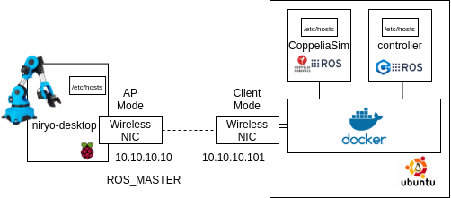

# Controller Node

## What is it?

This repository contains the code to control a Niryo One robot using the MoveIt framework and to access a digital twin I made as undergraduate final thesis in 2020 through an ROS API in C++. 

It contains a couple of integration tests to verify that the whole thing works and a routine to make the robot dance as a demonstration. 

## Run it

To run this you will need to first connect to a network where the Niryo One and the digital twin is are deployed. 

The following image is an example of a deployment. 

Then you will need to change the values for the ROS_IP, the ROS_MASTER, and setup the host IPs for the Niryo One and the digital twin hosts inside the script `./run_container`. 

In order for MoveIt to be able to control the Niryo One in real time, you will need to synchronize the clocks. This can be done very efficiently by setting a ptpd master on a node of the network and connecting clients to it.  

`ptpd -V -m -i <interface> # Start a ptpd master.`
`ptpd -V -s -i <interface> # Start a ptpd slave.`

Once you have done that, install Docker in your machine and execute the `./run_container` script. 
It will take some time to setup because we have to assemble a ROS kinetic image. 

Once it is done, it will start launching integration tests to both the simulated twin and the digital twin. 

You can find the code to deploy the digital twin [here](https://github.com/jairomer/niryo_one_simulation). 
